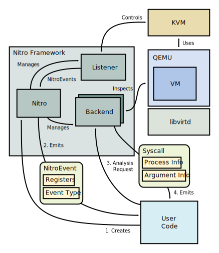

Architecture
============

In this chapter, we take a look at how the project is structured and how the
different components fit together.

   Main components of Nitro

Virtual Machines
----------------

Listeners
---------

Low-level NitroEvents
-----------

Backends
--------

System Call Events
------------------

Process Info
------------

System Call Arguments
---------------------

